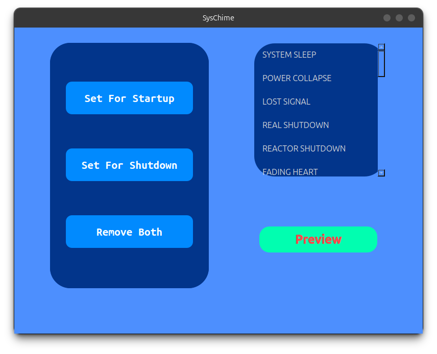

# SysChime 🔔

> A lightweight Linux system sound manager for configuring custom startup and shutdown melodies.

SysChime is a Linux desktop application built with **Python** and **PySide6** that lets you configure custom sounds for system startup and shutdown.

Instead of manually editing shell scripts or system configuration files, SysChime provides a simple graphical interface for previewing melodies and assigning them to different system events.

---

## ✨ Features

### Current Features

* 🎵 **Preview melodies**

  * Listen to available system melodies before applying them.

* 🚀 **Set startup sound**

  * Choose a melody to play when the system starts.

* 🛑 **Set shutdown sound**

  * Choose a melody to play when the system shuts down.

* 🗑️ **Remove startup sound**

  * Remove the currently configured startup melody.

* 🗑️ **Remove shutdown sound**

  * Remove the currently configured shutdown melody.

* 🔒 **Prevent conflicting configurations**

  * SysChime prevents the user from repeatedly assigning different melodies to the same system event without removing the existing configuration first.

* 💻 **Linux-focused**

  * Designed specifically for Linux systems and integrates with system startup/shutdown behavior.

---

## 🖥️ Preview

> Add screenshots of SysChime here after publishing the project.

```text
+--------------------------------------------------+
|                     SysChime                     |
+--------------------------------------------------+
|                                                  |
|  Available Melodies                              |
|                                                  |
|  > Startup Chime                                 |
|    Industrial Startup                            |
|    Classic Buzzer                                |
|    Power On                                      |
|                                                  |
|  [ ▶ Preview ]                                   |
|                                                  |
|  Startup Sound                                   |
|  [ Set Startup Sound ]                           |
|  [ Remove Startup Sound ]                        |
|                                                  |
|  Shutdown Sound                                  |
|  [ Set Shutdown Sound ]                          |
|  [ Remove Shutdown Sound ]                       |
|                                                  |
+--------------------------------------------------+
```

---

## 🎯 Why SysChime?

Linux provides many ways to customize system behavior, but configuring system sounds manually can require working with shell scripts, system services, permissions, and configuration files.

SysChime provides a graphical interface that makes this process easier.

The goal is simple:

> **Choose a sound → Preview it → Assign it to a system event.**

No manual configuration is required for normal usage.

---

## 🛠️ Technology Stack

SysChime is built using:

| Technology  | Purpose                  |
| ----------- | ------------------------ |
| Python      | Application logic        |
| PySide6     | Graphical user interface |
| Qt Designer | UI design                |
| Linux Shell | System integration       |
| Bash        | System sound execution   |
| Git         | Version control          |
| GitHub      | Source code hosting      |

---

## 📋 Requirements

### Operating System

SysChime is currently designed for:

* Linux
* systemd-based distributions

It may work on other Linux distributions, but compatibility depends on how the distribution handles startup and shutdown services.

### Software Requirements

* Python 3.10+
* PySide6
* Bash
* A Linux system with the required system-management components

You can install the Python dependencies with:

```bash
pip install -r requirements.txt
```

---

## 📥 Installation

### 1. Clone the repository

```bash
git clone https://github.com/hiddent3rminal/SysChime.git
```

Enter the project directory:

```bash
cd SysChime
```

### 2. Create a virtual environment

Creating a virtual environment is recommended:

```bash
python3 -m venv .venv
```

Activate it:

```bash
source .venv/bin/activate
```

### 3. Install dependencies

```bash
pip install -r requirements.txt
```

### 4. Run SysChime

```bash
python3 main.py
```

---

## 🚀 Usage

After launching SysChime, the application provides a list of available melodies.

### Preview a melody

1. Select a melody from the list.
2. Click **Preview**.
3. SysChime plays the selected melody without changing the current system configuration.

### Set startup sound

1. Select a melody.
2. Click **Set Startup Sound**.
3. SysChime configures the selected melody for system startup.

### Set shutdown sound

1. Select a melody.
2. Click **Set Shutdown Sound**.
3. SysChime configures the selected melody for system shutdown.

### Remove a startup sound

Click:

```text
Remove Startup Sound
```

The existing startup configuration will be removed.

### Remove a shutdown sound

Click:

```text
Remove Shutdown Sound
```

The existing shutdown configuration will be removed.

---

## 🔊 How It Works

SysChime consists of two main parts:

```text
                 SysChime
                    │
        ┌───────────┴───────────┐
        │                       │
     GUI Layer              System Layer
        │                       │
     PySide6                 Bash / Linux
        │                       │
        └───────────┬───────────┘
                    │
              System Events
               /          \
          Startup        Shutdown
```

The graphical interface is responsible for user interaction.

The system layer handles the actual configuration and execution of the selected sounds.

---

## 📁 Project Structure

A typical SysChime project structure looks like this:

```text
SysChime/
│
├── main.py
├── requirements.txt
├── README.md
├── LICENSE
├── .gitignore
│
├── ui/
│   └── ...
│
├── sounds/
│   └── ...
│
├── scripts/
│   └── ...
│
└── assets/
    └── ...
```

### `main.py`

The main application entry point.

It initializes the Qt application and starts the SysChime interface.

### `ui/`

Contains the graphical interface and/or generated Qt files.

### `sounds/`

Contains the available melodies and sound resources.

### `scripts/`

Contains shell scripts used for Linux system integration.

### `assets/`

Contains project assets such as icons and other resources.

---

## 🧩 Architecture

SysChime separates the graphical interface from the system operations.

```text
User
 │
 ▼
PySide6 GUI
 │
 ▼
Application Logic
 │
 ├── Melody Selection
 ├── Preview
 ├── Startup Configuration
 ├── Shutdown Configuration
 └── Configuration Removal
 │
 ▼
Linux System
 │
 ├── Startup
 └── Shutdown
```

This separation makes the project easier to maintain and extend.

---

## 🔐 Configuration Protection

SysChime is designed to prevent accidental configuration conflicts.

For example, if a startup sound has already been configured:

```text
Startup Sound
      │
      ▼
Already configured
      │
      ▼
Prevent another startup assignment
```

The user can first remove the existing configuration and then assign a new sound.

This prevents multiple startup/shutdown configurations from being created unintentionally.

---

## 🎵 Sound System

SysChime was originally inspired by a simple Linux shell-based buzzer system.

The project turns that concept into a complete graphical application.

A melody can be represented as a sequence of frequencies and durations.

For example:

```bash
beep -f 1000 -l 100
beep -f 1200 -l 100
beep -f 1400 -l 150
```

This allows SysChime to create simple electronic, industrial, or notification-style melodies.

---

## ⚙️ Configuration Behavior

SysChime supports independent startup and shutdown configurations.

For example:

```text
Startup:
Industrial Startup

Shutdown:
Heavy Motor Shutdown
```

These configurations are independent of each other.

A user can:

* Set startup only
* Set shutdown only
* Set both
* Remove startup
* Remove shutdown
* Remove both

---

## 🧪 Development

Clone the repository:

```bash
git clone https://github.com/hiddent3rminal/SysChime.git
cd SysChime
```

Create a virtual environment:

```bash
python3 -m venv .venv
source .venv/bin/activate
```

Install dependencies:

```bash
pip install -r requirements.txt
```

Run the application:

```bash
python3 main.py
```

---

## 🧹 Code Style

The project follows common Python development practices.

Recommended guidelines:

* Use descriptive variable and function names.
* Keep functions focused on a single responsibility.
* Avoid unnecessary global state.
* Handle system command failures properly.
* Validate user input.
* Keep GUI code separate from system operations where possible.
* Add comments only where they provide useful context.

---

## 🐛 Troubleshooting

### SysChime does not start

Make sure Python is installed:

```bash
python3 --version
```

Then verify the dependencies:

```bash
pip install -r requirements.txt
```

Try running:

```bash
python3 main.py
```

---

### PySide6 is missing

Install it with:

```bash
pip install PySide6
```

Or install all project dependencies:

```bash
pip install -r requirements.txt
```

---

### A sound does not play

Check whether the required Linux sound utility is installed and available:

```bash
which beep
```

If it is not available, install the appropriate package for your Linux distribution.

For Debian/Ubuntu-based systems, this may be:

```bash
sudo apt install beep
```

> The exact audio/speaker behavior may vary depending on the hardware and Linux configuration.

---

### Startup or shutdown sound does not execute

Check:

* Whether the configuration was successfully created.
* Whether the required script has execute permissions.
* Whether the system service/event configuration is correct.
* Whether the selected sound exists.
* Whether the system allows the required hardware access.

You can inspect script permissions with:

```bash
ls -l
```

and make a script executable with:

```bash
chmod +x script.sh
```

---

## 🛡️ Permissions

Some SysChime operations may require elevated privileges because they modify system-level startup or shutdown behavior.

When necessary, SysChime may need to interact with protected Linux locations or services.

Avoid running the entire application as root unless it is actually required.

Prefer granting elevated privileges only to the specific operation that needs them.

---

## 🗺️ Roadmap

SysChime is planned to grow beyond startup and shutdown sounds.

### Version 1.0

* [x] Preview sound
* [x] Set startup sound
* [x] Set shutdown sound
* [x] Remove startup sound
* [x] Remove shutdown sound
* [x] Prevent conflicting configurations
* [x] Graphical interface
* [x] Qt Designer-based UI

### Future Versions

* [ ] Notification sounds
* [ ] Custom melody creator
* [ ] Import custom melodies
* [ ] Delete custom melodies
* [ ] Sound volume control
* [ ] Sound categories
* [ ] More system events
* [ ] Configuration status indicators
* [ ] Improved error messages
* [ ] Automatic dependency detection
* [ ] Better distribution compatibility
* [ ] Application packaging
* [ ] Desktop launcher
* [ ] `.deb` package
* [ ] AppImage
* [ ] Additional Linux distribution support

---

## 💡 Future System Events

In future versions, SysChime could support additional events such as:

```text
System Startup
      │
      ├── Startup Sound
      │
      ├── Login Sound
      │
      ├── Notification Sound
      │
      ├── Device Connected
      │
      ├── Device Disconnected
      │
      └── System Shutdown
```

This would turn SysChime into a complete Linux system sound customization tool.

---

## 🤝 Contributing

Contributions are welcome!

If you want to contribute:

### 1. Fork the repository

Create your own fork of the project.

### 2. Clone your fork

```bash
git clone https://github.com/hiddent3rminal/SysChime.git
```

### 3. Create a branch

```bash
git checkout -b feature/my-feature
```

### 4. Make your changes

Implement your feature or fix.

### 5. Test your changes

Make sure the application still works correctly.

### 6. Commit

```bash
git add .
git commit -m "Add my feature"
```

### 7. Push

```bash
git push origin feature/my-feature
```

### 8. Open a Pull Request

Describe:

* What you changed
* Why you changed it
* How you tested it

---

## 📜 License

This project is licensed under the **MIT License**.

See the `LICENSE` file for more information.

---

## ⚠️ Disclaimer

SysChime interacts with Linux system configuration and may modify startup/shutdown behavior.

Use the application responsibly.

The project is primarily designed and tested for Linux environments. Behavior may differ between distributions, desktop environments, kernels, hardware configurations, and system configurations.

Always make sure you understand what a system-level configuration change does before applying it.

---

## 👨‍💻 Author

**Amirali**

A technology enthusiast interested in:

* Linux
* Python
* Networking
* System Administration
* Cybersecurity
* Software Development

---

## ⭐ Support

If you find SysChime useful, consider giving the repository a ⭐ on GitHub.

Issues, feature requests, and pull requests are welcome.

---

## 📸 Screenshots


```markdown

```


## 📄 License

MIT License

Copyright (c) 2026 Amirali

Permission is hereby granted, free of charge, to any person obtaining a copy
of this software and associated documentation files, to deal in the Software
without restriction, including without limitation the rights to use, copy,
modify, merge, publish, distribute, sublicense, and/or sell copies of the
Software, and to permit persons to whom the Software is furnished to do so,
subject to the following conditions:

The above copyright notice and this permission notice shall be included in all
copies or substantial portions of the Software.

THE SOFTWARE IS PROVIDED "AS IS", WITHOUT WARRANTY OF ANY KIND, EXPRESS OR
IMPLIED, INCLUDING BUT NOT LIMITED TO THE WARRANTIES OF MERCHANTABILITY,
FITNESS FOR A PARTICULAR PURPOSE AND NONINFRINGEMENT. IN NO EVENT SHALL THE
AUTHORS OR COPYRIGHT HOLDERS BE LIABLE FOR ANY CLAIM, DAMAGES OR OTHER
LIABILITY, WHETHER IN AN ACTION OF CONTRACT, TORT OR OTHERWISE, ARISING FROM,
OUT OF OR IN CONNECTION WITH THE SOFTWARE OR THE USE OR OTHER DEALINGS IN THE
SOFTWARE.
